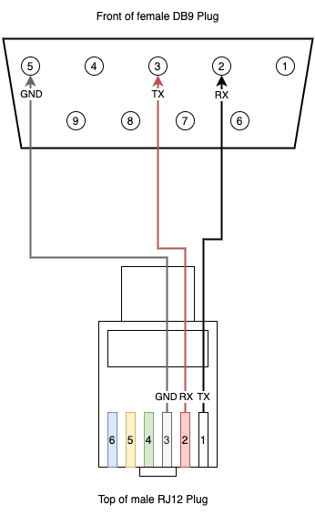

# NodeRenogy

Utility to retrieve data from Renogy solar controllers and publish it to MQTT, written in NodeJS.

Data can then be surfaced in Home Assistant, or anything else that can read from a MQTT bus.

It currently doesn't support all registers, however I will be continuing to add support for them.

## Compatibility

See below table, in theory this should work with any Renogy solar controller, but the below have been tested.
If you have success with one not listed here, please let me know by raising an issue!

|Controller|Interface|Notes|Status|
|----------|---------|-----|------|
|Renogy Wanderer|RS232|Has no switched load, so load values are always 0|✅|
|Renogy Rover|RS232|Tested with 20A version|✅|


## Supported Registers

The below is a list of supported registers for device information:
|Register|Description|Unit|
|--------|-----------|-----|
|0x00A|Controller voltage rating|Volts|
|0x00A|Controller current rating|Amps|
|0x00B|Controller discharge current rating|Amps|
|0x00B|Controller type||
|0x00C - 0x013|Controller model name||
|0x014 - 0x015|Controller software version||
|0x016 - 0x017|Controller hardware version||
|0x018 - 0x019|Controller serial number||
|0x01A|Controller MODBUS address||

The below is a list of supported registers for state data:
|Register|Description|Unit|
|--------|-----------|-----|
|0x100|Battery Capacity|Percent|
|0x101|Battery Voltage|Volts|
|0x102|Battery Charge Current|Amps|
|0x103|Battery Temperature|Celcius|
|0x103|Controller Temperature|Celcius|
|0x104|Load Voltage|Volts|
|0x105|Load Current|Amps|
|0x106|Load Power|Watts|
|0x107|Solar Panel (PV) Voltage|Volts|
|0x108|Solar Panel (PV) Current|Amps|
|0x109|Solar Panel (PV) Power|Watts|
|0x10B|Min Battery Voltage Today|Volts|
|0x10C|Min Battery Voltage Today|Volts|
|0x10D|Max Charge Current Today|Amps|
|0x10E|Max Discharge Current Today|Amps|
|0x10F|Max Charge Power Today|Watts|
|0x110|Max Discharge Power Today|Watts|
|0x111|Charge Amp/Hrs Today|Amp Hours|
|0x112|Discharge Amp/Hrs Today|Amp Hours|
|0x113|Charge Watt/Hrs Today|Watt Hours|
|0x114|Discharge Watt/Hrs Today|Watt Hours|
|0x115|Controller Uptime|Days|
|0x116|Total Battery Over-charges|Count|
|0x117|Total Battery Full Charges|Count|

## Connecting your Controller

Renogy controllers use either RS232 or RS485 for serial communications, for either you will need an interface that supports the protocol your controller uses. 

Generally, standard PC serial ports (DB9/DB25) are RS232, if your machine doesn't have one you can use a USB > Serial adapter. For RS485 you will need a USB > RS485 adapter or similar.

**NOTE:** TTL Serial (as found on Raspberry Pi's, Microcontrollers, etc) is **not** the same as RS232. RS232 operates at higher voltages and can damage equipment if connected to a TTL serial port. You **must** use an adapter (e.g. a MAX3232) with TTL serial ports.

I will be covering RS232 here, as that's what my controller (Renogy Wanderer) supports. I am using a USB > Serial adapter connected to a Raspberry Pi Zero. The adapter I have uses the Prolific PL2303 chipset, I would recommend one using this chipset. They can be had from [Amazon](https://www.amazon.co.uk/gp/product/B003WOWBBW/ref=ppx_yo_dt_b_asin_title_o00_s00?ie=UTF8&psc=1), etc for under £20.

### Building a cable

Once you have a way to connect to RS232 devices, you will also need a cable. As far as I can see, Renogy do not sell these. So, you will need to make one.

The Renogy Wanderer (and other controllers that use RS232) has a RJ12 jack that it uses for serial communications. This will need to be connected to your RS232 interface. In my use case, I built a RJ12 > DB9 cable to use with a Serial > USB adapter. 

The RJ12 connector on the controller has 6 pins, with the first 3 being needed for our cable. The remaining pins are for power. See the below table for the pinout.

|RJ12 Pin|DB9 Pin|Function|
|--------|-------|--------|
|1|2|Serial TX > RX|
|2|3|Serial RX > TX|
|3|5|Ground|
|4| |Ground|
|5| |VCC (+15V)|
|6| |VCC (+15V)|

RJ12 and DB9 Pins are counted right to left, with the contacts facing you.



When building your cable, *please* check voltages with a multimeter to ensure you have the connections correct. In my testing you should see ~5v between the TX (RJ12 Pin 1) and GND (RJ12 Pin 3), ~0.1v between RX (RJ12 Pin 2) and GND and ~5v between TX and RX)

## Using the utility

Ideally you would install/run this on a device that is connected to your solar controller all the time. I use a Raspberry Pi Zero W, which is more than powerful enough for this use case. 

This also assumes you have a MQTT broker setup and running already. If you don't want to use MQTT you can output the results to the console. Support for other output methods may come at a later date.

You will first need to ensure you have NodeJS v16+ installed on your device.

**NOTE**: If you installed a version of node with `apt-get` on your Pi Zero, please un-install it before installing Node v16.

The Pi Zero/One doesn't have official support for newer version of NodeJS, so follow the instructions [here](https://hassancorrigan.com/blog/install-nodejs-on-a-raspberry-pi-zero/) to get it installed.

If you are using a Pi 2 or later, follow the instructions [here](https://lindevs.com/install-node-js-and-npm-on-raspberry-pi/) to install the official NodeSource build.

Once you've got NodeJS installed, then follow the below instructions.

### Installation

1. Clone this repository (or download it) by running;

`git clone https://github.com/mickwheelz/NodeRenogy.git`

2. Change to the `NodeRenogy` directory and install the dependencies by running the below commands

 - Change to the directory you cloned the code into: `cd NodeRenogy`
 - Run installer: `npm install` 
 - Link command: `sudo npm link`

### Running the utility

Basic Example:

`node-renogy -s /dev/ttyUSB0 -m 192.168.0.10`

This would use serial port `/dev/ttyUSB0` and connect to MQTT Broker at `192.168.0.10` with no user/password, publishing to the `NodeRenogy/state` topic ever 60s.

The utility supports using different polling intervals and topics, as well as MQTT brokers that need authentication, please see below for a full list of options.

These options can also be passed as environment variables, by appending `NODERENOGY_` to the argument (e.g. `NODERENOGY_SERIALPORT=/dev/ttyUSB0`). This is useful when running as a service (see below section).

|Argument |Alias |Env Var|Description | Example |
|---------|------|----------|-----|----|
|--serialport|-s|NODERENOGY_SERIALPORT|REQUIRED: Serial port your controller is connected to|-s /dev/ttyUSB0|
|--baudrate|-b|NODERENOGY_BAUDRATE|The baud rate to use for serial communications, defaults to 9600|-b 14400|
|--mqttbroker|-m|NODERENOGY_MQTTBROKER|The address of your MQTT Broker|-m 192.168.0.10|
|--mqttuser|-u|NODERENOGY_MQTTUSER|The username for your MQTT Broker|-u mqttUser|
|--mqttpass|-p|NODERENOGY_MQTTPASS|The password for your MQTT Broker|-p mqttPass| 
|--mqtttopic|-t|NODERENOGY_MQTTTOPIC|MQTT topic to publish to defaults to 'NodeRenogy'|-t MyTopic|
|--pollinginterval|-i|NODERENOGY_POLLINGINTERVAL|How frequently to poll the controller in seconds, defaults to 10|-i 60|
|--loglevel|-l|NODERENOGY_LOGLEVEL|Sets the logging level, useful for debugging|-l trace|   
|--help|-h||Show help ||
|--version|||Show version number|  |    

### Running as a service

The utility can be configured to run as a service, including on startup.

These instructions are for Rasbpbian, but should work on any Debian based distro (Ubuntu, etc) or any system that uses systemd.

1. Create a service definition file. This file should contain your required environment variables.

Example:
```
[Unit]
Description=NodeRenogy Service

[Service]
ExecStart=node-renogy
Restart=always
User=pi
Group=pi
Environment=PATH=/usr/bin:/usr/local/bin
Environment=NODE_ENV=production
Environment=NODERENOGY_SERIALPORT=/dev/ttyUSB0
Environment=NODERENOGY_MQTTBROKER=192.168.0.10
WorkingDirectory=/home/pi/NodeRenogy

[Install]
WantedBy=multi-user.target
```
Note the `Environment=...` lines, set any configuration options here such as serial port, MQTT broker, interval, etc.

2. Name this file `noderenogy.service` and save it in `/etc/systemd/system`

3. Run the following commands:

 - To start the service: `systemctl start noderenogy`

 - To check the logs/ensure its running: `journalctl -u noderenogy`

 - To enable the service to run at startup: `systemctl enable noderenogy`

## Publishing to MQTT

The utility will publish one topic, with two subtopics on your MQTT Broker. You specify the topic name in the configuration with the default being `NodeRenogy`

The first subtopic is `<topic>/device`. This is published once when the utility is first run and contains information about the controller.

Example:

```
{
  "controllerV":12,
  "controllerC":30,
  "controllerDischgC":20,
  "controllerType":"Controller",
  "controllerModel":" RNG-CTRL-WND30",
  "softwareVersion":"V1.0.4",
  "hardwareVersion":"V1.0.3",
  "serialNumber":1116960,
  "controllerAddress":1
}
```

The second is `<topic>/state` which contains data pulled from the controller, it is published at the interval specified in the configuration (e.g. every 10s).

Example:
```
{
  "battCap":96,
  "battV":"13.10",
  "battC":"2.12",
  "battT":24,
  "controlT":18,
  "loadV":"0.00",
  "loadC":"0.00",
  "loadP":0,
  "solarV":"13.10",
  "solarC":"2.12",
  "solarP":27,
  "battVMinToday":"12.10",
  "battVMaxToday":"13.40",
  "chgCMaxToday":"3.51",
  "dischgCMaxToday":"0.00",
  "chgPMaxToday":"46.00",
  "dischgPMaxToday":"0.00",
  "chgAHToday":"4.00",
  "dischgAHToday":"0.00",
  "chgWHToday":"50.00",
  "dischgWHToday":"0.00",
  "uptime":15,
  "totalBattOvercharge":9,
  "totalBattFullCharges":3
}
```
You can then subscribe the topics with a MQTT client and data as you wish. An example of this would be surfacing it in Home Assistant. See below for more information on how to do that.

## Getting data into Home Assistant

The values can be displayed in Home Assistant by adding them as [sensors](https://www.home-assistant.io/integrations/sensor.mqtt/) in the `configuration.yaml` files. 

Essentially you just need to extract the values from the JSON payload published to MQTT. For each value you want to use in Home Assistant, add a MQTT sensor entry in your config file.

See below for some examples:

```
sensor:
 |platform: mqtt
    name: "Current Battery Capacity"
    state_topic: "NodeRenogy/state"
    value_template: "{{ value_json['battCap'] }}"
    unit_of_measurement: "%"
    device_class: battery

- platform: mqtt
    name: "Current Battery Voltage"
    state_topic: "NodeRenogy/state"
    value_template: "{{ value_json['battV'] }}"
    unit_of_measurement: "V"
    device_class: battery
```
